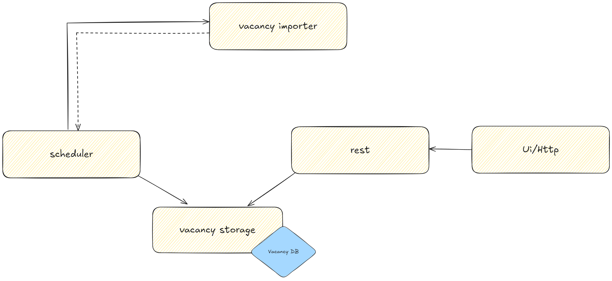

# Vacancy Management Service

## Overview

https://face-it-vacancy-app.onrender.com

This service is designed for managing vacancies. It interacts with multiple components for importing, storing, and providing vacancies through a REST API. The service is modular, with different folders corresponding to specific functional parts.

## Components

### 1. Scheduler

- **Description**: The `Scheduler` is responsible for the initial population and periodic execution of the `Vacancy Importer` to import new vacancies.
- **Functionality**:
    - Configured to run at specific intervals to ensure vacancy data remains up-to-date.
    - Interacts with `Vacancy Storage` to manage the schedule and update data.

### 2. Vacancy Importer

- **Description**: The `Vacancy Importer` handles the process of importing vacancies from [external sources](https://www.arbeitnow.com/api/job-board-api).
- **Functionality**:
    - Retrieves vacancy data from an external API.
    - After retrieving the data, it forwards them to `Vacancy Storage` for saving.

### 3. Vacancy Storage

- **Description**: `Vacancy Storage` manages the storage of vacancies in the database.
- **Functionality**:
    - Receives vacancy data from `Vacancy Importer` and saves it in the `H2 Database`.
    - Provides an interface for interacting with stored vacancies for other components.

### 4. Vacancy DB

- **Description**: The `Vacancy DB` is the database where all vacancies are stored.
- **Functionality**:
    - Serves as the data storage layer for vacancies managed by the service.

### 5. REST API

- **Description**: The `REST API` provides endpoints for external clients to interact with the service.
- **Functionality**:
    - Supports GET operations for vacancies.
    - The API interacts with `Vacancy Storage` to retrieve vacancy data.

### 6. UI/HTTP

- **Description**: `UI/HTTP` is an external component responsible for handling HTTP requests.
- **Functionality**:
    - Connects to the `REST API` to allow users to interact with vacancies via a web interface or HTTP requests.

## Workflow

1. The `Scheduler` periodically triggers the `Vacancy Importer` to fetch new vacancy data.
2. The `Vacancy Importer` gathers data from the external [API](https://www.arbeitnow.com/api/job-board-api) and returns it to the `Scheduler`.
3. The `Scheduler` passes the vacancies to `Vacancy Storage`, which then saves them to the database.
4. External clients can interact with the vacancy data through the `REST API`, which communicates with `Vacancy Storage`.

## Module Structure

All components are part of a single module but are organized into different folders based on their functionality. This ensures clear organization, ease of maintenance, and adherence to logical boundaries within the service.

## REST API Documentation

### VacancyController

The `VacancyController` is a key component of the REST API, allowing external clients to interact with the vacancy data. It provides endpoints to retrieve all vacancies with pagination, get the top 10 most popular vacancies, and obtain statistics on vacancies by location.

### 1. **Get All Vacancies**

- **Endpoint**: `GET /api/v1/vacancies`
- **Description**: Retrieves a paginated list of all vacancies.
- **Parameters**:
    - `page`: The page number to retrieve (e.g., `1`, `2`, `3` etc.).
    - `size`: The number of vacancies per page.
    - `sort`: Sorting criteria (e.g., `location,desc` for sorting by date in descending order).
- **Response**:
    - Returns a `Page<VacancyDto>` containing the list of vacancies.
    - Each `VacancyDto` includes details such as the vacancy title, company, location, and more.

### 2. **Get Top 10 Most Popular Vacancies**

- **Endpoint**: `GET /api/v1/vacancies/top-10`
- **Description**: Retrieves the top 10 most popular vacancies based on predefined criteria.
- **Response**:
    - Returns a `List<VacancyDto>` containing the top 10 most popular vacancies.

### 3. **Get Location Statistics**

- **Endpoint**: `GET /api/v1/vacancies/statistic/location`
- **Description**: Retrieves statistics on vacancies by location (city and number of vacancies).
- **Parameters**:
    - `page`: The page number to retrieve the statistics for.
    - `size`: The number of locations per page.
- **Response**:
    - Returns a `Page<VacancyLocationStatisticDto>` containing the statistics on vacancies by location.
